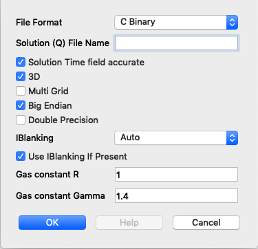

.. _Read_Write_Options:

Database Read Options
---------------------
Several database plugins have options that affect reading and/or writing with that
format. These are described in this section. Alternatively, in some cases, the
behavior of a database plugin may be affected by enviornment variables.

Blueprint
~~~~~~~~~

MFEM LOR Setting
""""""""""""""""
This option allows the user to select a MFEM Low-Order-Refinement Scheme. The two options are Legacy LOR and MFEM LOR. The Legacy setting was previously VisIt's only LOR method in the Blueprint Plugin. It produces discontinuous output, while the new option produces a continuous low order mesh. This new option is the default.

MFEM
~~~~

MFEM LOR Setting
""""""""""""""""
This option allows the user to select a MFEM Low-Order-Refinement Scheme. The two options are Legacy LOR and MFEM LOR. The Legacy setting was previously VisIt's only LOR method in the MFEM Plugin. It produces discontinuous output, while the new option produces a continuous low order mesh. This new option is the default.

Exodus
~~~~~~

Detect Compound Variables
"""""""""""""""""""""""""

Checking this option will cause the plugin to try to guess that similarly named
variables are the scalar components of an aggregate type such as a vector,
tensor or array variable. The plugin will then automatically define expressions
for these aggregate typed variables. For example, it will cause the plugin to
combine three scalar variables with names such as ``velx``, ``vely`` and ``velz``
into a *vector* expression ``vel`` defined as ``{velx, vely, velz}``. Note that
this is just a convenience to free users from having to define expressions
manally within their VisIt_ session.

Use Material Convention
"""""""""""""""""""""""

With this option, the user can cause the plugin to recognize standard or custom
*material conventions*. The Exodus file format does not define any specific
standards for handling advecting and *mixing* materials. Different data
producers have defined different conventions. A few pre-defined conventions for
handling mixed materials from Exodus files are supported. In addition, users can
define their own custom conventions as well. For a custom convention, the user
must define the *namescheme* that will produce the names of the scalar variables
holding material volume fractions. Optionally, users can specify a namescheme to
produce the names of the scalar variables holding material-specific values for an
associated non-material-specific variable.

The
`nameschemes <https://wci.llnl.gov/sites/wci/files/2020-08/LLNL-SM-654357.pdf?#page=226>`_
used here are identical to those described in the
`Silo user's manual <https://wci.llnl.gov/sites/wci/files/2020-08/LLNL-SM-654357.pdf>`_
with one extension. The conversion specifier ``%V`` is used to denote the basename
(non-material-specific) name of a set of scalar variables holding material
specific values.

The ALEGRA nameschemes for volume fraction and material specific variables are
``"@%s@n?'&VOLFRC_%d&n&':'VOID_FRC':@"`` and ``"@%V_%d@n"``.

The CTH nameschemes are ``"@%s@n?'&VOLM_%d&n&':'VOID_FRC':@"`` and ``"@%V_%d@n"``.

Finally, in all cases it is assumed materials are identified starting from index
one (1).  The special material id of zero (0) is used to denote void.

Material Count
++++++++++++++

Ordinarily, the plugin will determine the material count from the material
convention nameschemes. However, if it is having trouble getting the correct
count, users can specify it manually with this option. 

ffp
~~~
The ffp plugin can optionally use the
`STRIPACK library <https://people.sc.fsu.edu/~jburkardt/f_src/stripack/stripack.html>`_
to improve its behavior and performance. It will do so by loading the STRIPACK library as
a dynamicaly loaded shared library *when* VisIt_ can find it. VisIt_ will find the
STRIPACK library if it is available in the VisIt_ installation's top-level ``lib``
directory (typically something like ``/foo/bar/visit/3.1.1/linux-x86_64/lib``) or
if the enviornment variable ``VISIT_FFP_STRIPACK_PATH`` is set specifying a path to the
shared library as in

.. code-block:: shell

    setenv VISIT_FFP_STRIPACK_PATH /foo/bar/lib/libstripack.so

for csh (and friends) or for sh (and friends)...

.. code-block:: shell

    export VISIT_FFP_STRIPACK_PATH=/foo/bar/lib/libstripack.so

In client/server mode, the STRIPACK library must be installed on both the client
and the server.

The :ref:`build_visit <Building>` tool can be used to download, build and install the
STRIPACK library. Here is an example bash shell ``build_visit`` command-line...

.. code-block:: shell

    env FCFLAGS="-fdefault-real-8 -fdefault-double-8 -shared -fPIC" \
    STRIPACK_INSTALL_DIR=/usr/local/visit/lib ./build_visit --fortran \
    --no-visit --no-thirdparty --thirdparty-path /dev/null --no-zlib --stripack

Because STRIPACK is non-BSD licensed software, part of the ``build_visit``
process for installing it is to accept the STRIPACK license terms.

NASTRAN
~~~~~~~

Num Materials
"""""""""""""
This option allows the user to indicate that the NASTRAN plugin
should look for and try to define a material object. If the user knows the
*number* of materials in the input database, it is best to specify it here
because that will avert the plugin having to read all lines of the input before
understanding the material configuration. However, if the user does not know
the number of materials, enter ``-1`` here and the plugin will search for
all information related to the material configuration during the *open*. This will
lead to longer open times. A value of ``0`` here means to ignore any material
information if present.

PLOT3D
~~~~~~

Overview
""""""""

PLOT3D is a computer graphics program designed to visualize the grid and
solutions of structured computational fluid dynamics (CFD) datasets. It is
developed and maintained by `NASA <https://software.nasa.gov/software/ARC-14400-1>`_.
PLOT3D is not a self describing format. Therefore VisIt_ does not know if the
file it should read is:

- 2D or 3D
- Binary or ASCII
- Fortran-style (record based or not) or C-style
- Has Iblanking or not
- Single block or multiblock

To get VisIt_ to read your file, you need to give it hints. You do this with a
text file with extension `.vp3d`, which describes the variant of Plot3D being
used, or through the Read options that can be set when opening the file.

VisIt_ will perform some amount of auto-detection for binary files. If
auto-detection fails, then VisIt_ will fall back to settings from '.vp3d' if
used, or Read options otherwise. If VisIt_ doesn't display your data as expected,
some of these options may need to be tweaked. Auto-detection will most likely
fail for non-record based Fortran binary files.

Please Note: If your single-grid data file has the 'nblocks' field, you will
need to tell VisIt_ it is a 'MultiGrid' file. VisIt_ will then correctly read
'nblocks' and create single-grid output.

Example vp3d file
"""""""""""""""""

::

  # Files:
  #
  # Note: the Grid file and Solution file fields do not have to be specified.
  # If they do not appear, VisIt will assume that the .vp3d should be replaced
  # with ".x" for the grid file and ".q" for the solution file.
  #
  # Support for time-series solution files added in VisIt 2.10.0.
  # VisIt will look for '*' and '?' wildcards in the solution name
  # 
  GRID NHLP_2D.g
  # SOLUTION NHLP_2D.q
  # Time-series example, requesting all time steps
  # SOLUTION NHLP_2D_*.q
  # Time-series example requesting subset of time steps
  # SOLUTION NHLP_2D_??3?.q
  
  # Single/Multi Grid. Single grid will be assumed if no value is specified.
  #
  # Options:
  MULTI_GRID
  # SINGLE_GRID
  
  # Data encoding, ASCII or Binary. Binary will be assumed if no value is
  # specified.
  #
  # Options:
  #BINARY
  ASCII
  
  # Endianness. This only applies to BINARY files. Native endian will
  # be assumed if no value is specified.
  #
  # Options:
  #LITTLE_ENDIAN
  #BIG_ENDIAN
  
  # OBSOLETE, Structured assumed, due to lack of unstructured sample data
  # Structured grid vs unstructured grids. Structured grids will be assumed
  # unless stated otherwise.
  #
  # Options:
  # STRUCTURED
  # UNSTRUCTURED
  
  # Iblanking in the file. No iblanking is assumed unless stated otherwise.
  #
  # Options:
  # NO_IBLANKING
  # IBLANKING
  
  # Ignore iblanking. If there is iblanking in the file, you can opt to ignore it.
  #
  # Options:
  # IGNORE_IBLANKING
  
  # 2D vs 3D. 3D will be assumed unless stated otherwise.
  #
  # Options:
  2D
  # 3D
  
  # Precision. Single precision is assumed unless stated otherwise.
  #
  # Options:
  SINGLE_PRECISION
  # DOUBLE_PRECISION
  
  # Compression. This only applies to ASCII files. Some codes compress
  # repeated values as 4*1.5 as opposed to 1.5 1.5 1.5 1.5. It is assumed
  # the data is not compressed unless stated otherwise.
  #
  # Options:
  # COMPRESSED_ASCII
  # UNCOMPRESSED_ASCII
  
  # C vs Fortran Binary. C-Binary is assumed.
  # VisIt 2.10.0, added FORTRAN_BINARY_STREAM, to differentiate between
  # record-based (FORTRAN_BINARY) and non record based (FORTRAN_BINARY_STREAM)
  # Options:
  # C_BINARY
  # FORTRAN_BINARY
  # FORTRAN_BINARY_STREAM
  
  # Time. Tells VisIt whether or not the 'Time' field in the solution file is accurate.
  # If set to '1', VisIt will use this as the 'time' value displayed in plots for time-series data. (Default)
  # If set to '0', and this is time-series data, VisIt will attempt to parse the 'time' from the solution file name.
  SOLUTION_TIME_ACCURATE 1
  
  # R, Gamma values (used for computing functions like Temperature, Pressure, Enthalpy, Entropy)
  # Defaults are shown.
  # R 1.0
  # GAMMA 1.4

Read Options via GUI
""""""""""""""""""""

Read Options via CLI
""""""""""""""""""""

::

  # MDServer must be started in order grab the default Open options for the reader
  OpenMDServer("localhost")
  # Grab the default options
  opts = GetDefaultFileOpenOptions("PLOT3D")
  # and change a couple of things 
  # specify sub-selection of time slices.
  opts["Solution (Q) File Name"] = r"Jespersen.1/???3?"
  opts["Solution Time field accurate"] = 0
  SetDefaultFileOpenOptions("PLOT3D", opts)
  OpenDatabase(data_path("./TaperedCylinder/grid.p3d"), 0, "PLOT3D_1.0")

Or, you can create your own subset of the options:

::

  opts = {'Multi Grid':1, "Solution (Q) File Name":"wbtr.bin"}
  SetDefaultFileOpenOptions("PLOT3D", opts)
  OpenDatabase(data_path("./WingBodyTail/wbtg.bin"), 0, "PLOT3D_1.0")

Here are the defaults:

::

  >>> opt = GetDefaultFileOpenOptions("PLOT3D")
  >>> print opt
  {
    'File Format': 'C Binary # Options are: ASCII, C Binary, Fortran binary, Fortran binary stream',
    'Solution (Q) File Name': '',
    'Solution Time field accurate': 1,
    '3D': 1,
    'Multi Grid': 0,
    'Big Endian': 1,
    'Double Precision': 0,
    'IBlanking': 'Auto # Options are: Auto, Always, Never',
    'Use IBlanking If Present': 1,
    'Gas constant R': 1.0,
    'Gas constant Gamma': 1.4
  }

Silo_
~~~~~

Ignore Extents
""""""""""""""

The Silo_ database plugin has the ability to load spatial and data extents for
Silo_ multi-block (e.g. multiple domain) objects. This feature is an optional
*acceleration* feature that enables VisIt to cull domains based on knowledge
of downstream operations. For example, it can avoid reading domains known not
to intersect a slice plane. However, if the data producer creates buggy extents
data, this can lead to problems during visualization. So, the Silo_ plugin has
read options to disable spatial and data extents. The options for each are
``Always``, ``Auto``, ``Never`` and ``Undef``\ (ined) where ``Always`` and
``Never`` mean to always *ignore* or never *ignore* the extents data and
``Auto`` means to ignore extents data for files written by data producers known
to have issues with extents data in the past. The ``Undef`` setting is to deal
with cases where users may have :ref:`saved settings <How to Save Settings>` with
very old versions of these options.

Force Single
""""""""""""
The ``Force Single`` check box enables the Silo_ library's
`DBForceSingle() <https://wci.llnl.gov/sites/wci/files/2020-08/LLNL-SM-654357.pdf?#page=41>`_
method. This can potentially be useful when reading double precision data and
running out of memory.

Search for ANNOTATION_INT (and friends)
"""""""""""""""""""""""""""""""""""""""
The ``ANNOTATION_INT`` (and friends) objects are generic containers sometimes
used to store mesh-specific data using Silo_'s
`compound array <https://wci.llnl.gov/sites/wci/files/2020-08/LLNL-SM-654357.pdf?#page=260>`_.
However, because there is no multi-block analog for Silo_ compound arrays, in
order to handle them VisIt_ needs to be forced to go searching for their
existance in all the files comprising a multi-block database. Thus, enabling
this option can result in much slower database *open* times.

ZipWrapper
~~~~~~~~~~

TMPDIR
""""""
Specifies the directory to be used for temporary, decompressed files.
Defaults to ``$TMPDIR`` which will then resolve to the ``$TMPDIR``
environment variable which if either not defined or not a writable
directory will then default to either ``/usr/tmp`` or ``/var/tmp``
and finally ``$HOME`` environment variable.

Don't atexit()
""""""""""""""
Ordinarily, when VisIt_ exits, it will remove any decompressed files it
left around from invocations of ZipWrapper's decompression logic. This
disables removal of decompressed files upon exit from VisIt_.

Max. # decompressed files
"""""""""""""""""""""""""
Specifies the maximum number of decompressed files that can be in existance
at any one time. Default is 50. In parallel, this is a total summed over
all processors unless a negative number is specified in which case it is the
total per processor (useful for processor local tmp directories).

Unique moniker for dirs made in $TMPDIR
"""""""""""""""""""""""""""""""""""""""
An arbitrary string designed to be highly *unique* among all possible
processes that can write to ``TMPDIR``. Defaults to ``$USER`` which
will then resolve to the ``$USER`` enviornment variable.

Decompression command
"""""""""""""""""""""
Specifies the decompression command to use to decompress files. Default is
to use file extension to determine command according to table below

==============   =====================
File Extension   Decompression Command
==============   =====================
.gz              gunzip -f
.bz              bunzip -f
.bz2             bunzip2 -f
.zip             unzip -o
==============   =====================
