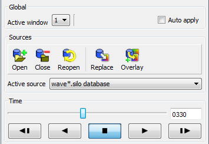

.. _Time Pane:

Time Pane
---------

The **Time Pane** contains controls for setting the active timestep, and
VCR controls for playing animations.

Setting the active timestep
~~~~~~~~~~~~~~~~~~~~~~~~~~~~

When a time-varying database is open, the animation controls are activated so 
any timestep in the database can be used. Note that the animation controls 
are only active when visualizing a time-varying database or when VisIt is in 
keyframe animation mode.

Time-varying databases are composed of one or more timesteps which contain 
data to be visualized. The active timestep is the timestep within a 
time-varying database that VisIt uses to generate plots. The **Time pane**
is located just below the **Sources pane** and contains controls 
that allow you to set the active timestep used for visualization. The
**Animation slider** and the **Animation text field** show the active time 
step. To set the active timestep, you can drag the **Animation slider**
and release it when you get to the desired timestep, or you can type in a
cycle number into the **Animation text field** . If you type in a cycle number 
that is not in the database, the active timestep will be set to the timestep 
with the closest cycle number to the cycle that was specified. 

.. _TimeVaryingAnimationControls:

   Controls for setting the active timestep

Playing animations
~~~~~~~~~~~~~~~~~~

The **Time pane** also contains a set of **VCR buttons** that allow you to put 
VisIt into an animation mode that plays your visualization using all of the 
timesteps in the database. The **VCR buttons** are only active when you have a
time varying database. The leftmost VCR button moves the animation back one 
frame. The VCR button second from the left plays the animation in reverse. The 
middle VCR button stops the animation. The VCR button second from the right 
plays the animation. The VCR button farthest to the right advances the 
animation by one frame. As the animation progresses, the **Animation Slider**
and the **Animation Text Field** are updated to reflect the active timestep.
